### RestContent - Headless CMS for backend developer
 [](https://github.com/restsend/restcontent/actions) [](https://goreportcard.com/report/github.com/restsend/restcontent) [](https://pkg.go.dev/badge/github.com/restsend/restcontent)

RestContent is a Headless CMS written in Go+Alpine, supports multiple sites, media libraries, and multiple users, and provides content management services for iOS, Android, Nuxt, Next, etc.

RestContent is mainly for backend developers, it does not require any configuration files, and provides a simple UI for initialization and configuration. It is very suitable for backend developers who do not want to learn NPM/YARN and do not want to be bound by complex configuration files.

RestContent is still in the early stages of development, and there are still many features to be implemented. If you are interested, please join us.

Maintained by [RestSend](https://restsend.com?from=restcontent)

### Features
 - [x] Based on Go+Alpine, no configuration files, no need to learn NPM/YRAN, support Sqlite and Mysql
 - [x] Multisite
 - [x] Built-in WYSIWYG editor
    - Markdown (based on easymde)
    - HTML editor (based on jodit)
    - JSON editor (based on jsoneditor)
 - [X] Multimedia Library
 - [X] Import and export for easy data migration
 - [X] Built-in initialization UI, no need to understand complex configuration files
 - TODO:
    - Multiple users and rights management
    - Api Token
    - Comment
    - Multi-language
### Quick Start
#### Docker
```bash
docker run -d -p 8080:8080 --name restcontent restsend/restcontent
```
#### Build from source
```bash
git clone https://github.com/restsend/restcontent.git
cd restcontent/cmd
go build
./restcontent
```

### Screenshots
 - Dashboard & Setup
    - 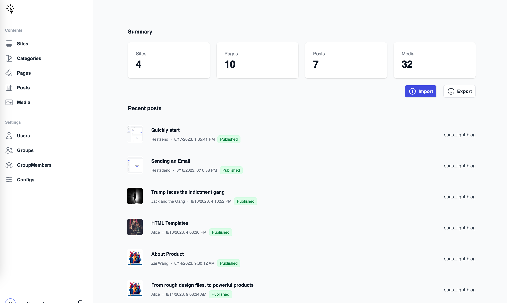
    - 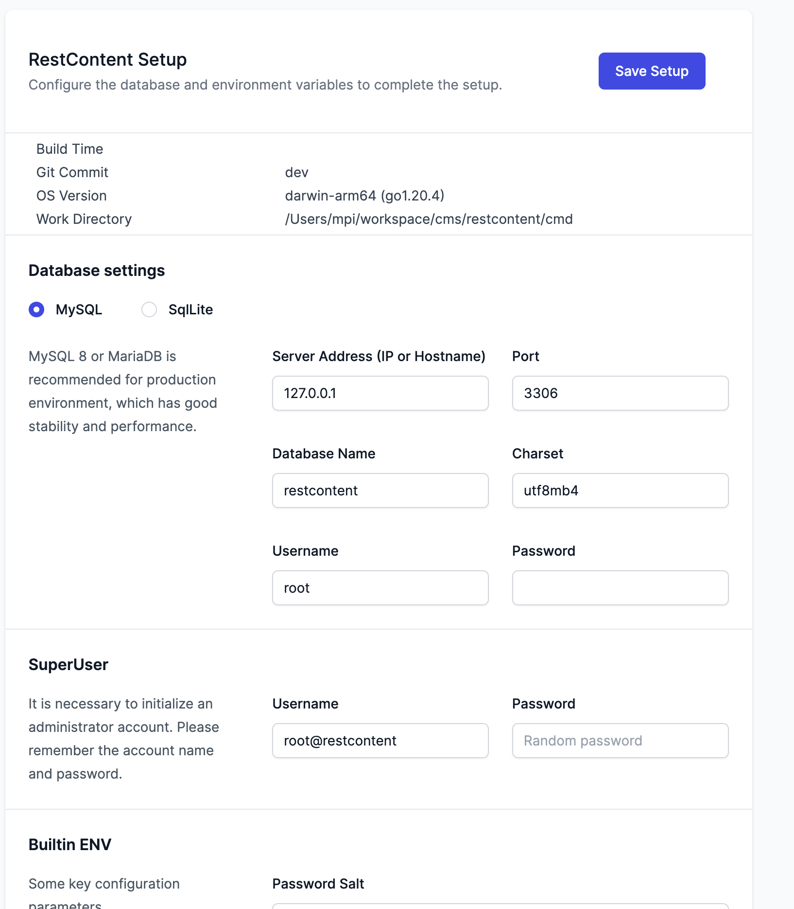
 - Import & Export
    - 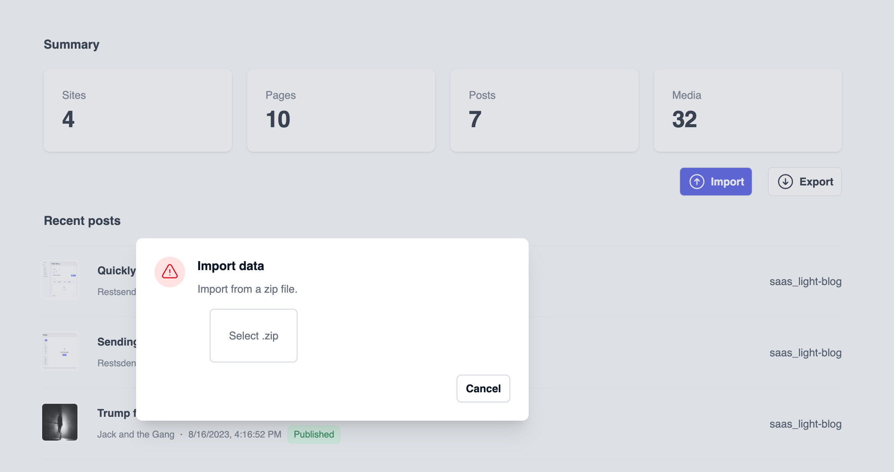
    - 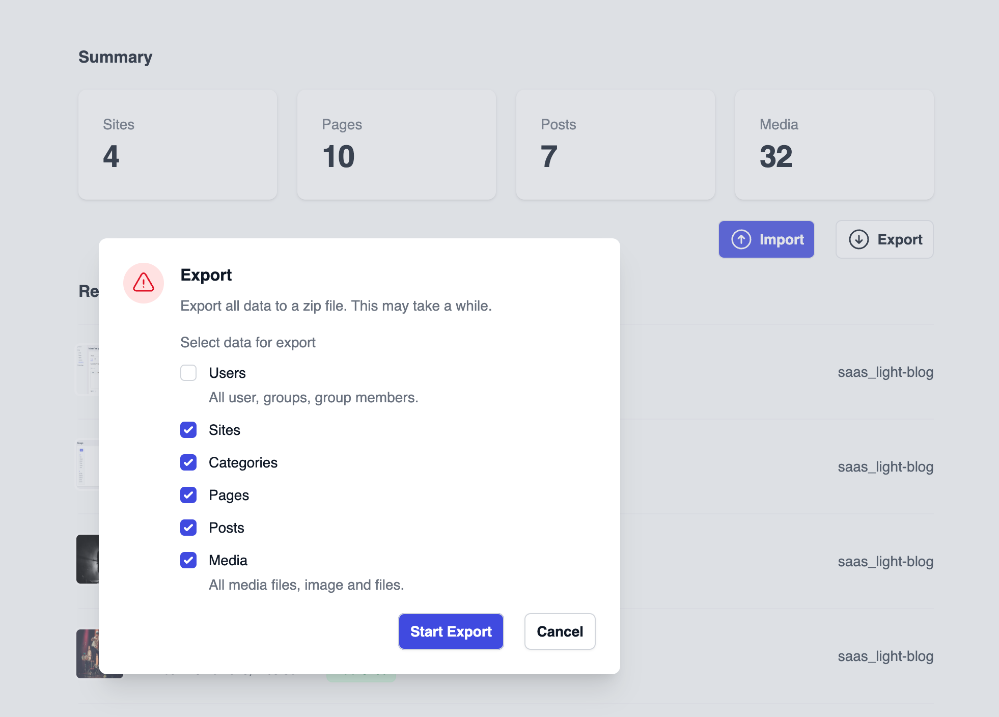
 - Category
    - 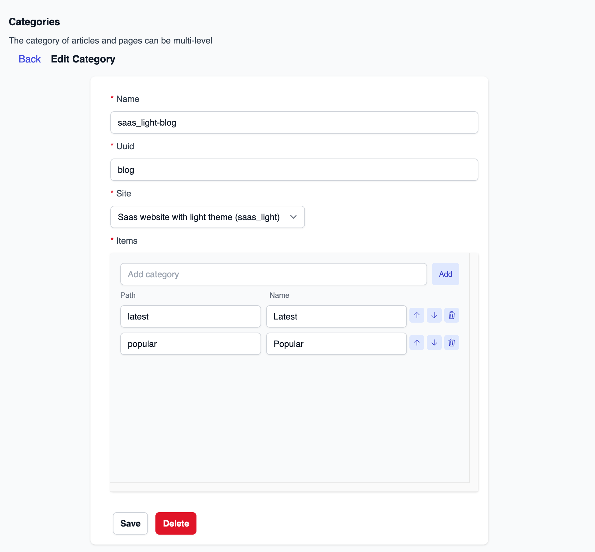
 - Page
    - 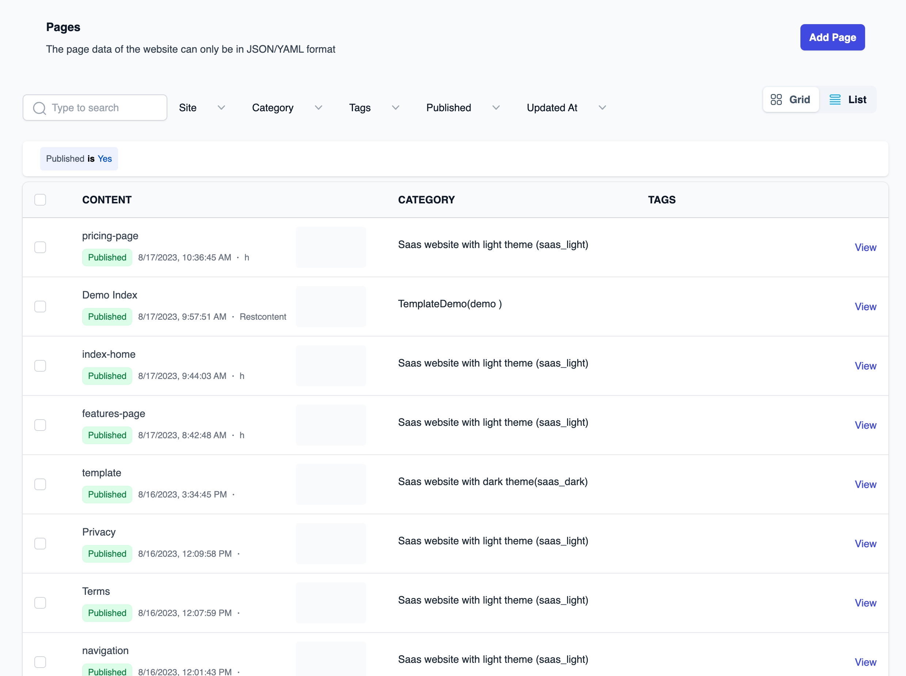
    - 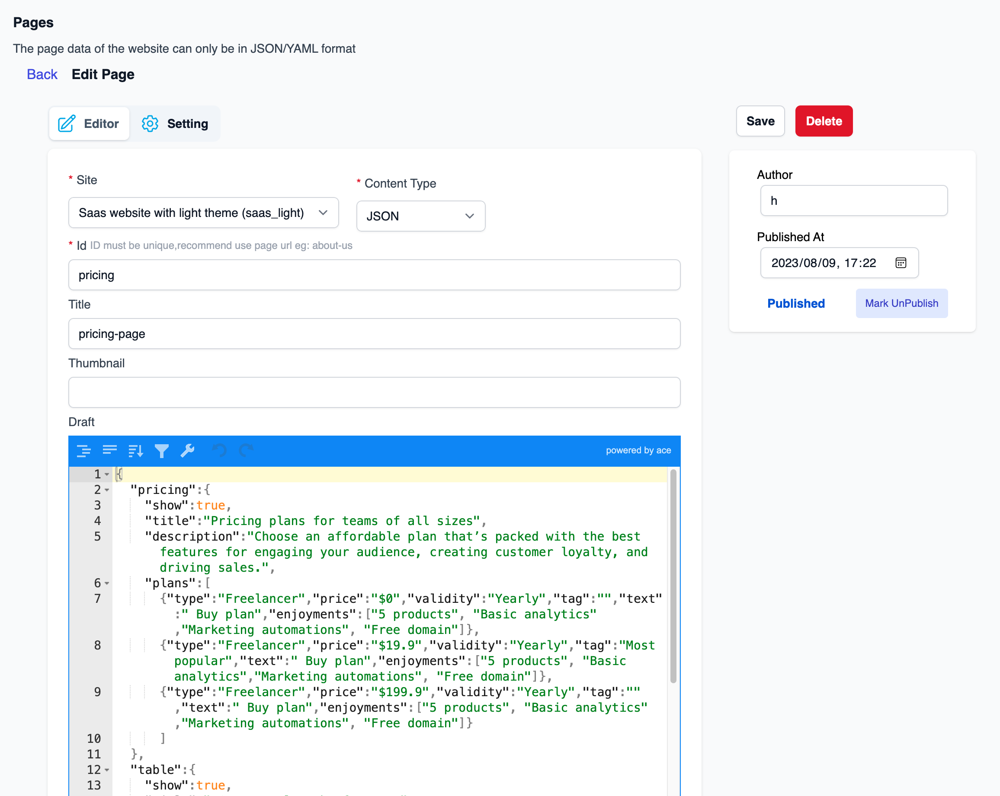
    - 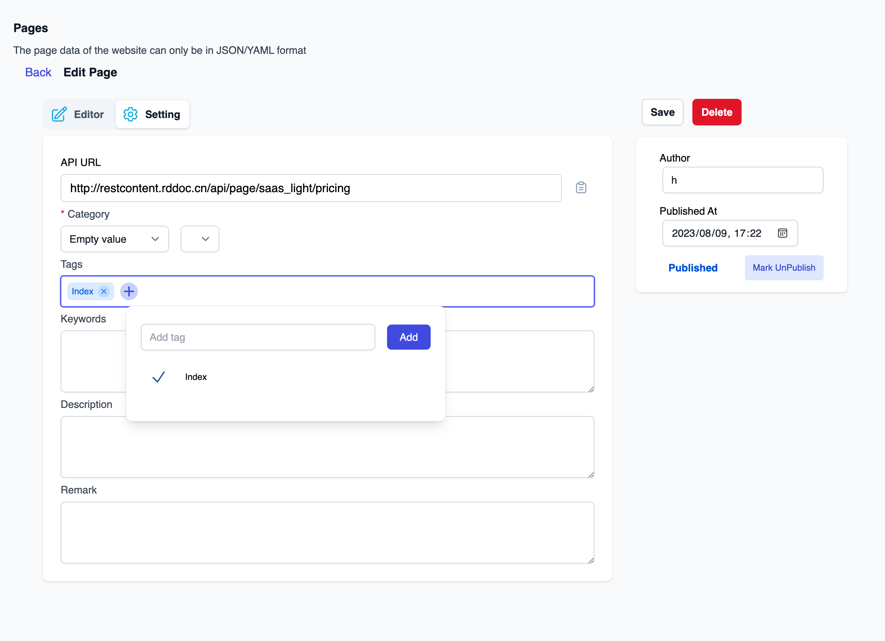
 - Post
    - 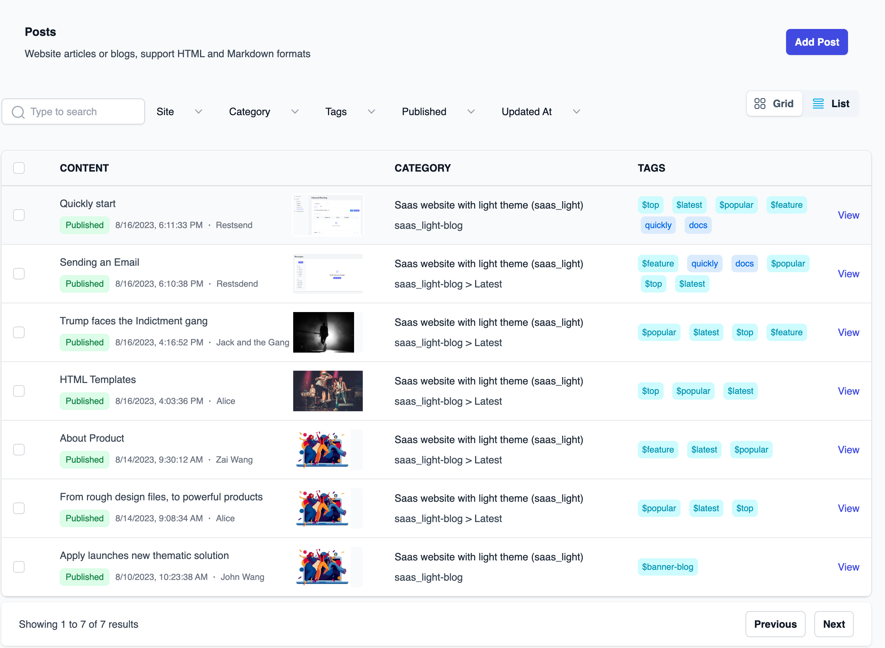
    - 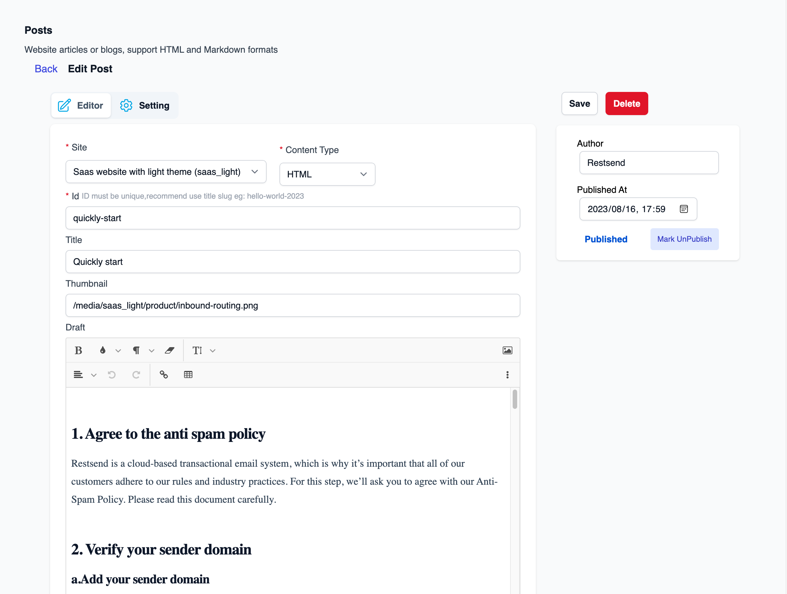
    - 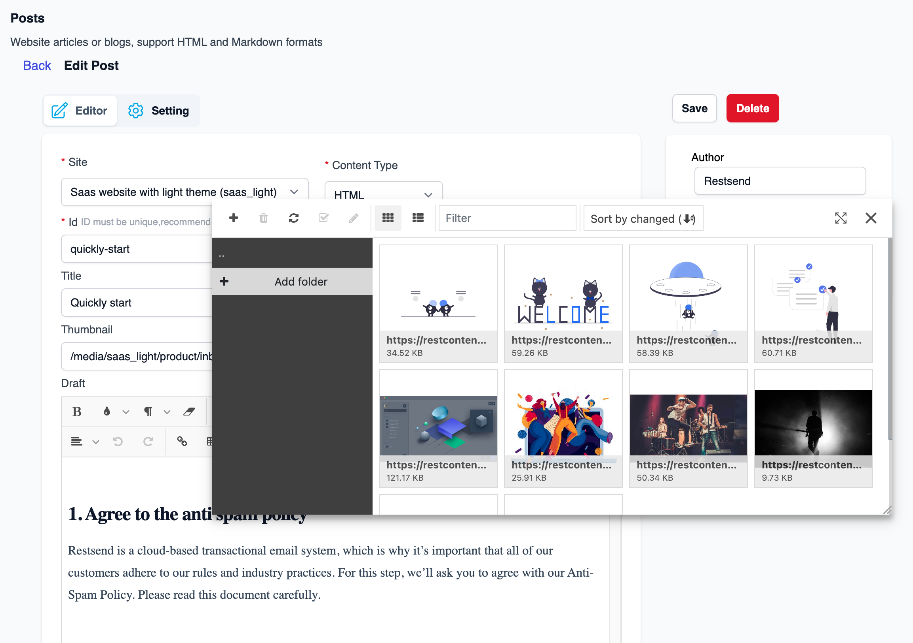
 - Media
    - 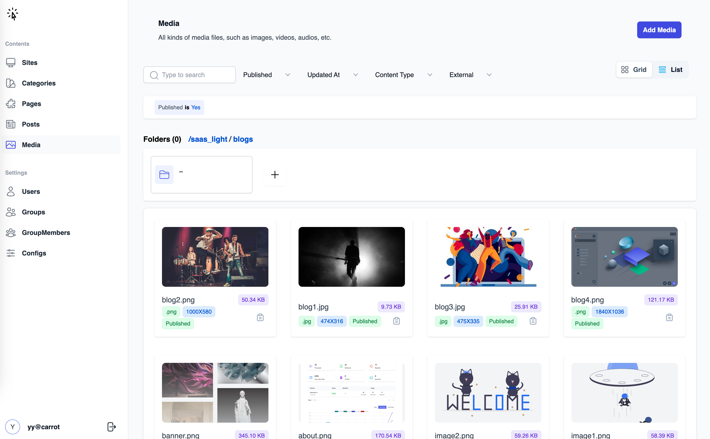
    - 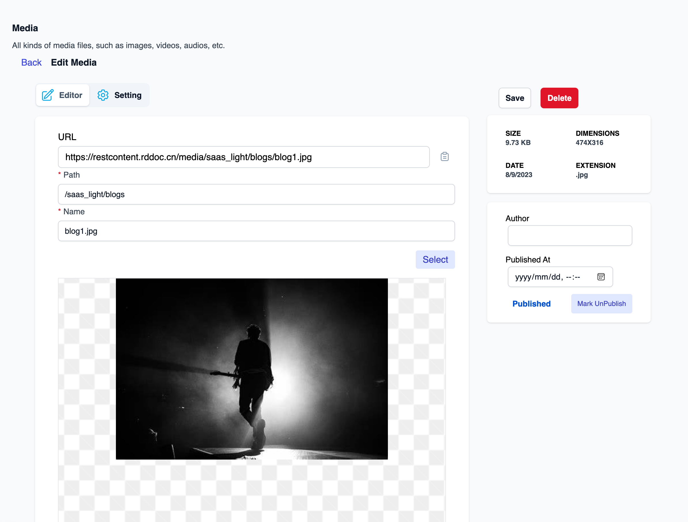
 - Setting with database
    - 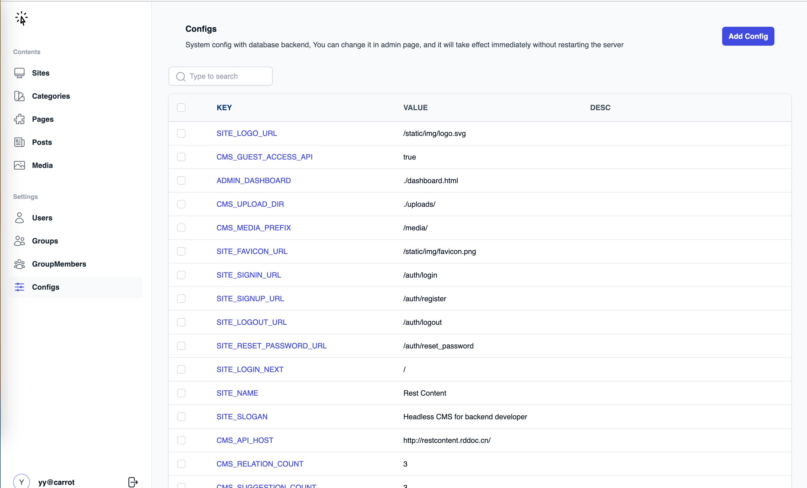